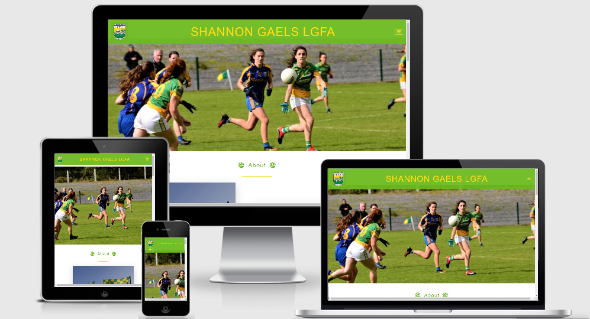
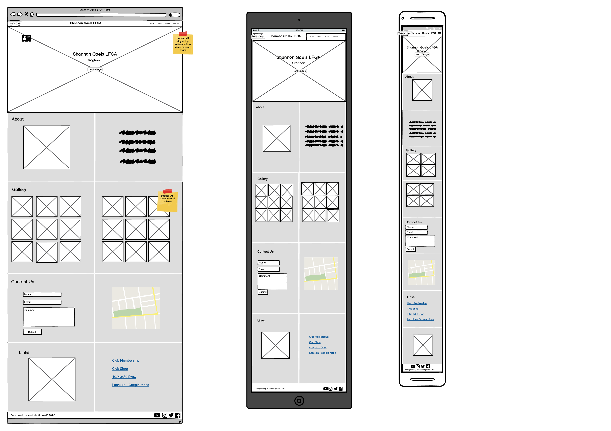
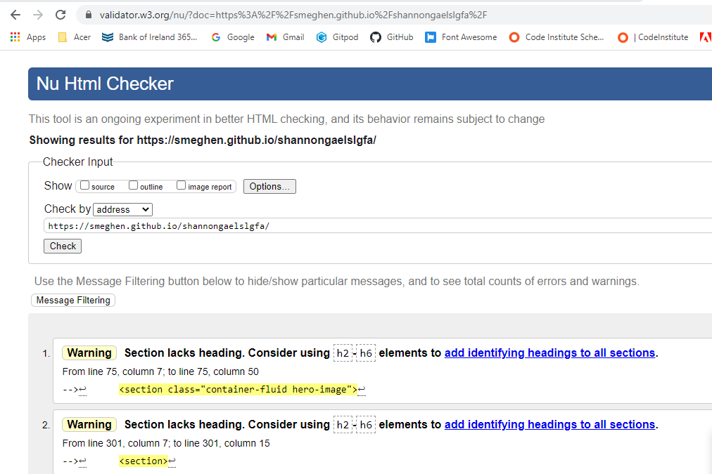
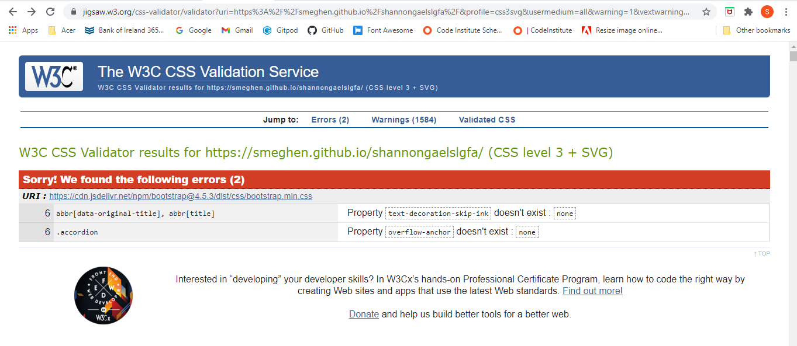

# Milestone Project 1
---
## Purpose

This site was designed for the first milestone project in Full Stack Software Development with the Code Institute, based on the learnings from HTML, CSS and User Centric Design modules.

---

## Shannon Gaels LGFA

I decided to create a site for the Shannon Gaels Ladies Gaelic Football Club based on the fact
 that they currently don’t have a website and being involved in coaching one of the underage teams, 
 I thought it would be a great opportunity to provide more information and hopefully inspire 
 new members to join. In the future I hope to add more features to the site that will benefit 
 both the club and members.
 
 The live website can be found here: https://smeghen.github.io/shannongaelslgfa/

---
### User Experience (UX)

#### User Stories:
*First Time Visitors:*
* I want to immediately understand the nature of the site and learn more about the organisation.
* I want to be able to easily navigate through the site, with the structure of the content easy to follow.
* I want to easily access relevant information.
* I want to be able to access the site from all device types.

*Returning Visitors:*
* I want to be able to contact the Club with questions that I might have.
* I want to be able to access the social media links of the Club.
* I want to be able find the location of the Club grounds.

*Frequent Visitors:*
* I want to be able to access the links for Club membership and for purchasing Club kit.
* I want to be able to see details on the nominated Charity of the Month.
* I want to see recent photos of the club and its players.

## Structure:
The main aim of this site is to provide details, pictures and links relating to the Shannon Gaels Ladies Gaelic 
Football Club. The site content will be both factual, inspirational and practical for all users. 
This is achieved by providing club history, aspirational pictures of club matches and players. 
Finally, having links to club location and key resources.

With this in mind a single-page layout with easy flow from section to section is best suited to the 
users that will be accessing the site. There will be a navigation menu contained in a fixed top 
header, which means that the user will be easily able to move around the site as needed. 
This will fulfil the user story -
> I want to be able to easily navigate through the site, with the structure of the content easy to follow.

The home page contains a high-quality image with the club name. This is then followed on by the 
About section of the site, which gives details on the club and some history. This will fulfil the user story -
> I want to immediately understand the nature of the site and learn more about the organisation.

The Gallery section will contain several pictures of the club grounds, players and recent matches. 
This will fulfil the user story - 
> I want to see recent photos of the club and its players.

The Contact section will contain a form for contacting the club and it will also 
contain the location of the club grounds on Google Maps. This will fulfil the user stories –
> I want to be able to contact the Club with questions that I might have.

> I want to be able find the location of the Club grounds.

The Information section will have links for Club registration, purchasing club kit and the 
club fundraising site. This will fulfil the user stories –
> I want to be able to access the links for Club membership and for purchasing Club kit.

> I want to be able to see details on the nominated Charity of the Month.

The Footer will contain the links for the club’s various social media accounts. 
This will fulfil the user story - 
> I want to be able to access the social media links of the Club.

It is envisioned that people accessing the site will range from young players, 
parents and interested parties in the community. With this is mind and the fact that 
most access will be by mobile devices; the design will be focused primarily for this 
format. The site will be responsive and the layouts will change dependant on screen size. 
This will ensure that the content of the site will remain appealing and readable on all 
devices. This will fulfil the user story - 
> I want to be able to access the site from all device types.

## Design:

Colour scheme: 

After consulting with some of the club officials, I decided that the use of the club colours of yellow and green would be the best to emphasise the club brand. The background colour is set as white with the yellow and green being incorporated into Navigation Bar, Footer, Section divider. I had originally thought of using the yellow and green for the background colour, but after trialling found it to be too overpowering and distracted from the content of the site.

Typography:

The main font used throughout the site is Open Sans, which is the official font used by the club. Sans Serif is used as a fallback font.

Imagery:
 
The club has provided me with their Logo, which will be used in the Navbar. Other images of the club sign, grounds, and flags were taken by me and will be used throughout the site, so that users can easily identify with the club.
The the hero image and the images in the gallery section were taken by Deirdre O’Dowd for the Shannon Gaels Club.

Wireframes:

Here is the wireframes that I used as the basis of the design
for the site. These were created using Balsamiq.

### Differences to Design
The following items were changed from the orginial design plans for the site:
* There was no animation placed on the hero image as I felt is was more of a distraction to
the image.
* The text on the hero image was removed as it mirrored what is already showing in the navbar.
* The layout of the links section was changed from a list to individual cards,
as I felt that some more information about each link would be more helpful to the site users.
* Rather than having a background colour of white for all sections, I alternated between white
and an off white to show clear seperation of sections, as with just white for all it was hard to 
know when you were transitioning from one section to another.

---
## Features:
##### Existing Features
##### Features to be Implemented in Future
---
## Technologies Used
* HTML -  HTML is the main language used for the structure of the site.
* CSS - Custom written CSS is used to style the site.
* Bootstrap – The layout and styling of the site was help by the use of Bootstrap framework.
* Google Fonts -The font of Open Sans was imported from Google Fonts.
* Font Awesome – Was used to obtain the social media icons used.
* Balsamiq – Was used to create the wireframes of the site on the various devices.
* Adobe Photoshop Express - Used to resize images used on the site. https://www.adobe.com/ie/photoshop/online/resize-image.html
* Git - Git is used for the version control of changes throughout the project.
* GitPod – was used as the coding space for the project.
* Github - was used to host the project files and publish the live website by using Git Pages.
* Autoprefixer - was used to parse  CSS and add vendor prefixes to CSS rules via https://autoprefixer.github.io/
* W3 HTML Validation was done via https://validator.w3.org/
* W3 CSS Validation was done via https://jigsaw.w3.org/css-validator/
* Google Chrome DevTools – was used extensively during coding to check the responsiveness of the site with the addition of new features.
---
# Testing
The testing of this project was based on the layout of the site, the proper operation of buttons, menus and links, and the responsiveness of the site on various device sizes. 

The following browsers were used to test the website – *Google Chrome, Microsoft Edge and Safari.*

Family members, peers of Slack and friends were asked to test the website and provide their thoughts on the user experience and any bugs that they found. Within this group of people the site was viewed on the following devices – *Desktop, Laptop, iPad mini, iPad, iPhone 6, iPhone 8, Samsung Galaxy S6 and Huawei P30.* 

Each section of the site was tested as follows:

NAVBAR: 
* Responsive across different screen sizes
* Menu reveals itself on clicking button
* Menu options change colour on hover
* Nav links go to sections of site on selection

HOME SCREEN:
* Hero image is responsive on all screen sizes.

ABOUT:
* Text and images cards are fully responsive on screens across all sizes.

GALLERY:
* Images are aligned and evenly spaced on screen
* Images do not overflow on smaller screens
* Images animate on hover
* Images open on new browser when selected

CONTACT:
* Form and Google Maps are responsive across all screen sizes
* Validation of correct form inputs for all fields
* Get redirected to thank you page on form submission
* Home button on thank you page works correctly

LINKS:
* Cards are fully responsive on screens across all sizes
* Buttons for links change colour on hover
* Links open on new browser when selected
* Links open on correct websites

FOOTER:
* Footer is responsive on screens across all sizes
* Social media links change colour on hover
* Social media links open on new browser when selected
* Links open on correct websites

The code was run through the W3C HTML Validator and no errors were found.

CSS Stylesheet was run through the W3C CSS Validator and showed 2 errors. Both of them relate to the 
Bootstrap CDN and are out of my control to rectify.

--- 

# Deployment

##  GitHub Project Creation
To create the project the following steps were used:

* In GitHub repositories section click the green 'New' button 
* Select the Code Institute template
* Name the repository and give a brief description
* Set repository to 'Public' to ensure the commit history is visible
* Click 'Create repository'

## Deploy with GitHub Pages
The website was deployed as follows:

* Open the repository in GitHub
* Navigate to the 'Settings' tab
* Scroll down to 'GitHub Pages' section
* Select 'Branch Master' as the source
* Click the save button
* Click on the link to go to the live deployed page

## Run Locally
To run the code locally:

* Navigate to the repository
* Click the 'Code' drop down menu
* Select to copy the GitHub URL from HTTPS box or 'Download Zip'
* Open a new terminal and type 'git clone' command in the CLI and paste copied URL
* Alternatively, click 'Open with GitHub Desktop' and follow the steps to complete the clone
---
# Issues Encountered

*  Having the links to the various sections of the site made the navbar look to busy and cluttered. 
	  Solution – used the navigation drop down menu from Bootstrap to tidy up the navbar.

* Could not change the colour of the navbar drop down menu icon to make the colour scheme of the site. 
After a search on Slack the solution was found to change from the default Bootstrap icon to the Fontawesome icon and styled it using CSS.

* Keeping the text on the hero image when changing from desktop to tablet/mobile.
Solution found on Stackoverflow to use viewport values for text size rather than px. 
Also, varied the position of the text by use of top and left margin percentages so that
 it is responsive for all devices. A media query for smaller screens is used to change 
 the margin percentages so that text stays in position.
https://stackoverflow.com/questions/32392383/how-to-center-text-responsive-in-image-using-css-html
*This was subsequently removed from the site as it was felt there was doubling up of information
on the image and the Navbar*

* Aligning the images in the Gallery section and keeping them responsive with changes in screen size.
	Code found on w3schools.com for aligning images side by side. I modified this code to make it work for my needs and added the necessary media queries to adjust the images on various screen sizes.
https://www.w3schools.com/howto/howto_css_images_side_by_side.asp

* Wanted to change the highlight colour of the Bootstrap form input fields.
Code found on Stackoverflow to change the colour of the form input highlight when selected. I modified this code to change the colour to match the colour scheme of the site.
https://stackoverflow.com/questions/14820952/change-bootstrap-input-focus-blue-glow

* Was not happy with the alignment of the Bootstrap cards used in the About section. As the images and text cards are different sizes, having them align side by side did not look visually right to me. 	After reading through the Bootstrap documentation and trialing several options, I decided that using “align-self-center” for the text cards worked best.

* Google Maps iframe was not responsive using Bootstrap.
Found solution on w3schools.com to make iframe responsive using CSS and code was adjusted to work for this site.
	https://www.w3schools.com/howto/howto_css_responsive_iframes.asp

---

# Credits

Hero Image and Club photos taken by Deirdre O’Dowd for the Shannon Gaels Club.

